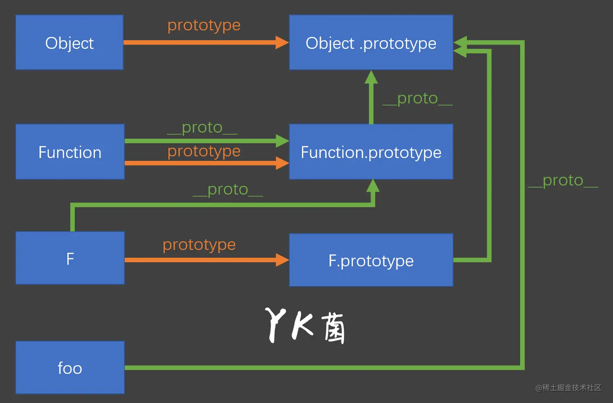
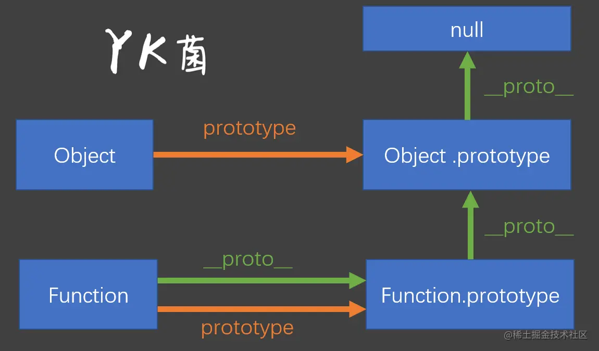
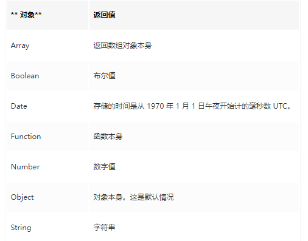

# JS学习

## 1.js的数据类型和强制类型转换

### js的基本数据类型有7种

* string
* boolean
* number
* symbol
* null
* undefined
* 对象

前面六种是基本类型，最后一个是对象类型，注意

1. `string` 、`number` 、`boolean` 和 `null` `undefined` 这五种类型统称为**原始类型**（Primitive），表示不能再细分下去的基本类型;

2. `symbol`是ES6中新增的数据类型，`symbol` 表示独一无二的值，通过 `Symbol` 函数调用生成，由于生成的 symbol 值为原始类型，所以 `Symbol` 函数不能使用` new` 调用；
3. `null` 和 `undefined` 通常被认为是特殊值，这两种类型的值唯一，就是其本身。

### number类型转换规则	

> - `null` 转换为 0
> - `undefined` 转换为 `NaN`
> - `true` 转换为 1，`false` 转换为 0
> - 字符串转换时遵循数字常量规则，转换失败返回` NaN`

什么时候转换为`number`类型

* 有加法运算符，但是无`String`类型的时候，都会优先转换为`Number`类型

* 除了加法运算符，其他运算符都会把运算自动转成数值

```javascript
true + 0 // 1
true + true // 2
true + false //1
//一元运算符（注意点）
+'abc' // NaN
-'abc' // NaN
+true // 1
-false // 0
```

### string类型转换规则

> - `null` 转换为 `'null'`
> - `undefined` 转换为 `'undefined'`
> - `true` 转换为 `'true'`，`false` 转换为 `'false'`
> - 数字转换遵循通用规则，极大极小的数字使用指数形式

什么时候转换为`string`类型

* 在没有对象的前提下

  字符串的自动转换，主要发生在字符串的**加法运算**时。当一个值为字符串，另一个值为非字符串，则后者转为字符串。

* 当有对象且与对象`+`时候

```javascript
'2' + 1 // '21'
'2' + true // "2true"
'2' + false // "2false"
'2' + undefined // "2undefined"
'2' + null // "2null"

//toString的对象
var obj2 = {
    toString:function(){
        return 'a'
    }
}
console.log('2'+obj2)
//输出结果2a

//常规对象
var obj1 = {
   a:1,
   b:2
}
console.log('2'+obj1)；
//输出结果 2[object Object]

//几种特殊对象
'2' + {} // "2[object Object]"
'2' + [] // "2"
'2' + function (){} // "2function (){}"
'2' + ['koala',1] // 2koala,1
```

### boolean类型转换规则

> 除了下述 6 个值转换结果为 `false`，其他全部为` true`：
>
> 1. undefined
> 2. null
> 3. -0
> 4. 0或+0
> 5. NaN
> 6. ''（空字符串）

什么时候进行`boolean`类型转换

- 布尔比较时
- `if(obj)` , `while(obj) `等判断时或者 三元运算符只能够包含布尔值

```javascript
if ( !undefined
  && !null
  && !0
  && !NaN
  && !''
) {
  console.log('true');
} // true

//下面两种情况也会转成布尔类型
expression ? true : false
!! expression
```

### 类型转换练习

```javascript
//类型转换相关问题
var bar=true;
console.log(bar+0);
console.log(bar+"xyz");
console.log(bar+true);
console.log(bar+false);
console.log('1'>bar);
console.log(1+'2'+false);
console.log('2' + ['koala',1]);

var obj1 = {
   a:1,
   b:2
}
console.log('2'+obj1)；

var obj2 = {
    toString:function(){
        return 'a'
    }
}
console.log('2'+obj2)

//输出结果  1 truexyz 2 1 false 12false 2koala,1 2[object Object] 2a

//作用域和NaN 这里不具体讲作用域，意在说明NaN
var b=1;
function outer(){
    var b=2;
    function inner(){
        b++;
        console.log(b);
        var b=3;
    }
    inner();
}
outer();
//输出结果 NaN
```

### 如何判断数据类型

三种方式，分别为 `typeof`、`instanceof` 和` Object.prototype.toString()`

```javascript
typeof 'seymoe'    // 'string'
typeof true        // 'boolean'
typeof 10          // 'number'
typeof Symbol()    // 'symbol'
typeof null        // 'object' 无法判定是否为 null
typeof undefined   // 'undefined'

typeof {}           // 'object'
typeof []           // 'object'
typeof(() => {})    // 'function'
```

1. `null` 的判定有误差，得到的结果

如果使用 `typeof`，`null`得到的结果是`object`

2. 操作符对对象类型及其子类型，例如函数（可调用对象）、数组（有序索引对象）等进行判定，则除了函数都会得到 `object` 的结果。

综上可以看出`typeOf`对于判断类型还有一些不足，在对象的子类型和`null`情况下。

参考资料：https://juejin.cn/post/6844903870712283149

## 2.js有几种类型的值？他们在内存使用上有什么区别

js有两种类型的值，一种是基本数据类型，另一种是引用类型（Object类）

* 声明变量时的区别

> 1.原始值存直接放在栈中
>
> 2.类的内容存放在堆中，引用(地址)存在栈中
>
> 原始数据类型直接存储在栈（stack）中的简单数据段，占据空间小、大小固定，属于被频繁使用数据，所以放入栈中存储。
>
> 引用数据类型存储在堆（heap）中的对象，占据空间大、大小不固定。如果存储在栈中，将会影响程序运行的性能；引用数据类型在
> 栈中存储了指针，该指针指向堆中该实体的起始地址。当解释器寻找引用值时，会首先检索其在栈中的地址，取得地址后从堆中获得实
> 体。

* 访问的区别

> 1.在javascript中是不允许直接访问保存在堆内存中的对象的，所以在访问一个对象时，首先得到的是这个对象在堆内存中的地址，然后再按照这个地址去获得这个对象中的值，这就是传说中的按引用访问。
>
> 2.而原始类型的值则是可以直接访问到的。　

* 复制变量时的区别

> 1）原始值：深拷贝
> 2）引用值：浅拷贝，仅仅复制了指针，并未复制堆中的内容

* 参数传递的区别

```javascript
let a = 1

function add(a) {
    a = a + 1
}

add(a)
console.log(a)// a = 1

let b = {
    value: 1
}

function bdd(b) {
    b.value = b.value + 1
}

bdd(b)
console.log(b) // b.value = 2
//如果参数是基本值类型，进行值传递，之后两个变量互不影响，如果参数是类，那么传递的引用，在函数内部的操作会影响到外边的类
```

## 3.什么是堆？什么是栈？它们之间有什么区别和联系？

> * 在数据结构中
>
> 栈中数据的存取方式为先进后出。而堆是一个优先队列，是按优先级来进行排序的，优先级可以按照大小来规定。完全
> 二叉树是堆的一种实现方式。
>
> * 在操作系统中
>
> 堆（heap）：用于动态分配内存，由程序员申请分配和释放。堆是从低地址位向高地址位增长，采用链式存储结构。频繁的malloc/free造成内存空间的不连续，会产生碎片。（**经常问如何解决内存碎片？**）当申请堆空间时库函数是按照一定的算法搜索可用的足够大的空间，因此堆的效率比栈要低的多。注：与数据结构中的堆不是一个概念，但堆的分配方式类似于链表。
>
> 栈(stack)： 由编译器自动释放，存放函数的参数值、局部变量等。每当一个函数被调用时，该函数的返回类型和一些调用的信息被存放到栈中，这个被调用的函数再为它的自动变量和临时变量在栈上分配空间。每调用一个函数一个新的栈就会被使用。栈区是从高地址位向低地址位增长的，是一块连续的内存区域，最大容量是由系统预先定义好的，申请的栈空间超过这个界限时会提示溢出。

## 4.内部属性 [[Class]] 是什么？

```javascript
//所有 typeof 返回值为 "object" 的对象（如数组）都包含一个内部属性 [[Class]]（我们可以把它看作一个内部的分类，而非
//传统的面向对象意义上的类）。这个属性无法直接访问，一般通过 Object.prototype.toString(..) 来查看。例如：
Object.prototype.toString.call( [1,2,3] );
// "[object Array]"
Object.prototype.toString.call( /regex-literal/i );
// "[object RegExp]"
// 我们自己创建的类就不会有这份特殊待遇，因为 toString() 找不到 toStringTag 属性时只好返回默认的 Object 标签
// 默认情况类的[[Class]]返回[object Object]
class Class1 {}
Object.prototype.toString.call(new Class1()); // "[object Object]"
// 需要定制[[Class]]
class Class2 {
  get [Symbol.toStringTag]() {
    return "Class2";
  }
}
Object.prototype.toString.call(new Class2()); // "[object Class2]"
```

## 5.介绍 js 有哪些内置对象？

注意：全局的对象（ global objects ）或称标准内置对象，不要和 "全局对象（global object）" 混淆。这里说的全局的对象是说在
全局作用域里的对象。全局作用域中的其他对象可以由用户的脚本创建或由宿主程序提供。

> 值属性：`Infinity` `NaN` `undefined` `globalThis`
>
> 函数属性：`eval()` `parseInt(0)` 等
>
> ...共14类

参考：https://developer.mozilla.org/zh-CN/docs/Web/JavaScript/Reference/Global_Objects

## 6.undefined 与 undeclared 的区别？

> - 已在作用域中声明但还没有赋值的变量，是 undefined 的。相反，还没有在作用域中声明过的变量，是 undeclared 的。
> - 对于 undeclared 变量的引用，浏览器会报引用错误，如 ReferenceError: b is not defined 。
> - 并且typeof 对 undefined 和 undeclared 变量返回的都是undefined。其实“ undefined” 和“ is not defined ”是两码事。

## 7.null 和 undefined 的区别？

> 如果一个值被声明却未赋值，那么就是undefined
>
> 对未定义的变量执行typeof操作符也会返回undefined
>
> 一个函数如果没有使用return语句指定返回值，就会返回一个undefined值
>
> 调用函数时没有传参数值，参数同样也会被初始化为undefined值
>
> 
>
> 从逻辑角度来看，null值表示一个空对象指针，指示变量未指向任何对象。把 null 作为尚未创建的对象，
>
> 一般变量声明了但还没有赋值的时候会返回 undefined，null主要用于赋值给一些可能会返回对象的变量，作为初始化。
>
> `undefined `不是保留字因此可以设置一个变量叫做undefined，null是保留字

```javascript
null == undefined    // true
null === undefined   // false   数据类型不同
//由于undefined可能会被重写（不是保留字）因此推荐使用如下判断方式，来判断是否是undefined
if(b === void 0){
    //
}
```

## 8.如何获取安全的 undefined 值？

如上

## 9.js代码基本规范

>在平常项目开发中，我们遵守一些这样的基本规范，比如说：
>
>（1）一个函数作用域中所有的变量声明应该尽量提到函数首部，用一个 var 声明，不允许出现两个连续的 var 声明，声明时
>    如果变量没有值，应该给该变量赋值对应类型的初始值，便于他人阅读代码时，能够一目了然的知道变量对应的类型值。
>
>（2）代码中出现地址、时间等字符串时需要使用常量代替。
>
>（3）在进行比较的时候吧，尽量使用'===', '!=='代替'==', '!='。
>
>（4）不要在内置对象的原型上添加方法，如 Array, Date。
>
>（5）switch 语句必须带有 default 分支。
>
>（6）for 循环必须使用大括号。
>
>（7）if 语句必须使用大括号。

## 10.JavaScript 原型，原型链？ 有什么特点？

- prototype: 显式原型
- __ proto__: 隐式原型

>所有的**函数**都有**显式原型**，显式原型是一个**对象**
>
>所有的**对象**都有**隐式原型**，指向其**构造函数的显式原型**
>
>注意Function的原型链`__proto__`指向本身构造函数，如下图所示
>
>调用一个对象（函数）的属性或者方法时，如果本身没有，那么必然沿着它的`__proto__`去找，
>
>prototype原型对象，本质上也是个对象，也有自己的`__proto__`原型链
>
>函数和对象的原型链区别
>
>有如下的函数定义和对象,，他们的原型链如图所示
>
>```javascript
>var F = function() {};
>var foo = {},
>let f = F()
>//小f的__proto__指向F的构造函数即prototype
>```
>
>



相关习题

第一题

```javascript
var F = function() {};

Object.prototype.a = function() {
  console.log('a');
};

Function.prototype.b = function() {
  console.log('b');
}

var f = new F();

f.a();
f.b();

F.a();
F.b();
```

第二题

```javascript
var A = function() {};
A.prototype.n = 1;
var b = new A();
A.prototype = {
  n: 2,
  m: 3
}
var c = new A();

console.log(b.n);
console.log(b.m);

console.log(c.n);
console.log(c.m);
```

第三题

```javascript
var foo = {},
    F = function(){};
Object.prototype.a = 'value a';
Function.prototype.b = 'value b';

console.log(foo.a);
console.log(foo.b);

console.log(F.a);
console.log(F.b);
```

第四题

```javascript
function A() {}
function B(a) {
    this.a = a;
}
function C(a) {
    if (a) {
        this.a = a;
    }
}
A.prototype.a = 1;
B.prototype.a = 1;
C.prototype.a = 1;

console.log(new A().a); 
console.log(new B().a);
console.log(new C(2).a);
```

第五题

```javascript
console.log(123['toString'].length + 123)
```

参考链接https://juejin.cn/post/7008526225207640078 https://juejin.cn/post/7007416743215759373

## 11. js 获取原型的方法？

```javascript
function R(){
}
var one=new R();
console.log(Object.getPrototypeOf(one));	//官方推荐，规范写法
console.log(one.__proto__);						//不报错，不推荐
console.log(one.constructor.__proto__)	//同上
```

## 12.在 js 中不同进制数字的表示方式

- 以 0X、0x 开头的表示为十六进制。
- 以 0、0O、0o 开头的表示为八进制。
- 以 0B、0b 开头的表示为二进制格式。

## 13. js 中整数的安全范围是多少？

```javascript
安全整数指的是，在这个范围内的整数转化为二进制存储的时候不会出现精度丢失，能够被“安全”呈现的最大整数是 2^53 - 1，
即9007199254740991，在 ES6 中被定义为 Number.MAX_SAFE_INTEGER。最小整数是-9007199254740991，在 ES6 中
被定义为 Number.MIN_SAFE_INTEGER。
```

```javascript
console.log(Number.MAX_SAFE_INTEGER)
//9007199254740991
```

## 14.typeof NaN 的结果是什么？

```javascript
NaN 意指“不是一个数字”（not a number），NaN 是一个“警戒值”（sentinel value，有特殊用途的常规值），用于指出
数字类型中的错误情况，即“执行数学运算没有成功，这是失败后返回的结果”。

typeof NaN; // "number"
console.log(NaN === NaN) //false
NaN 是一个特殊值，它和自身不相等，是唯一一个非自反（自反，reflexive，即 x === x 不成立）的值。而 NaN != NaN
为 true。
```

## 15.isNaN 和 Number.isNaN 函数的区别？

> 函数 isNaN 接收参数后，会尝试将这个参数转换为数值，**任何不能被转换为数值的的值都会返回 true**，因此非数字值传入也会
> 返回 true ，会影响 NaN 的判断。
>
> 函数 Number.isNaN 会首先判断传入参数是否为数字，如果是数字再继续判断是否为 NaN ，这种方法对于 NaN 的判断更为
> 准确。
>
> `Number.isNaN`更好

```javascript
console.log(isNaN(NaN))     //true
console.log(isNaN('12A'))   //true
console.log(isNaN('12'))    //false
console.log(Number.isNaN(NaN))   //true
console.log(Number.isNaN('12'))  //false
console.log(Number.isNaN('12a')) //false
```

## 16.Array 构造函数只有一个参数值时的表现？

> Array 构造函数只带一个数字参数的时候，该参数会被作为数组的预设长度（length），而非只充当数组中的一个元素。这样
> 创建出来的只是一个空数组，只不过它的 length 属性被设置成了指定的值。
>
> 构造函数 Array(..) 不要求必须带 new 关键字。不带时，它会被自动补上。

```javascript
// literal constructor
[element0, element1, /* ... ,*/ elementN]

// construct from elements
new Array(element0, element1, /* ... ,*/ elementN)

// construct from array length
new Array(arrayLength)
let a = new Array(5)
a[0] = 5
a[0] = 6
console.log(a)//[ 6, <4 empty items> ]
```

## 17.其他值到字符串的转换规则？

```javascript
console.log('' + true)
console.log('' + false)
console.log('' + 123)
console.log('' + undefined)
console.log('' + null)
console.log('' + NaN)

console.log(''+99999999999999999999999999999999999999999999999999999999999999999999999999999999999)//1e+83

//对普通对象来说，除非自行定义 toString() 方法，否则会调用 toString()（Object.prototype.toString()）
//来返回内部属性 [[Class]] 的值，如"[object Object]"。如果对象有自己的 toString() 方法，字符串化时就会调用该方法并使用其返回值。
console.log('' + {a: {b: 1}}) //[object Object]
let a = {
    toString() {
        return '666'
    }
}
console.log('' + a)//666
```

## 18.其他值到数字值的转换规则？

> （1）Undefined 类型的值转换为 NaN。
>
> （2）Null 类型的值转换为 0。
>
> （3）Boolean 类型的值，true 转换为 1，false 转换为 0。
>
> （4）String 类型的值转换如同使用 Number() 函数进行转换，如果包含非数字值则转换为 NaN，空字符串为 0。
>
> （5）Symbol 类型的值不能转换为数字，会报错。
>
> （6）对象（包括数组）会首先被转换为相应的基本类型值，如果返回的是非数字的基本类型值，则再遵循以上规则将其强制转换为数字。
>
> 为了将值转换为相应的基本类型值，抽象操作 ToPrimitive 会首先（通过内部操作 DefaultValue）检查该值是否有valueOf() 方法。如果有并且返回基本类型值，就使用该值进行强制类型转换。如果没有就使用 toString() 的返回值（如果存在）来进行强制类型转换。
>
> 如果 valueOf() 和 toString() 均不返回基本类型值，会产生 TypeError 错误

```javascript
console.log(1+undefined)//NaN
console.log(1+NaN) //NaN
console.log(1+null) //1
console.log(1+true) //2
console.log(1+false) //1
```

## 19.其他值到布尔类型的值的转换规则？

> 以下这些是假值：
>
> * undefined
> *  null
> * false
> * +0、-0 和 NaN
>
> * ""(空串)
>
> * void 0

## 20. {} 和 [] 的 valueOf 和 toString 的结果是什么？

> MDN
>
> 默认情况下，`toString()` 方法被每个 `Object` 对象继承。如果此方法在自定义对象中未被覆盖，`toString()` 返回 "[object *type*]"，其中 `type` 是对象的类型
>
> `valueOf()`返回指定对象的原始值。
>
> 

```javascript
let a = {
    v: 1
}
console.log(a.valueOf()) // { v: 1 }
console.log(a.toString()) //[object Object]
let b = []
console.log(b.valueOf()) //[]
console.log(b.toString()) // 空字符串
```

## 21.什么是假值对象？

> 浏览器在某些特定情况下，在常规 JavaScript 语法基础上自己创建了一些外来值，这些就是“假值对象”。假值对象看起来和
> 普通对象并无二致（都有属性，等等），但将它们强制类型转换为布尔值时结果为 false 最常见的例子是 document.all，它
> 是一个类数组对象，包含了页面上的所有元素，由 DOM（而不是 JavaScript 引擎）提供给 JavaScript 程序使用。

```javascript
let a = {}
undefined
Boolean(a) //true
Boolean(document.getElementById('all'))//false
```

## 22.`~` 操作符的作用？

> 这是js中的一元操作符：`按位取反`。
> `~` 返回 2 的补码，并且 ~ 会将数字转换为 32 位整数，因此我们可以使用 `~ `来进行取整操作。
>
> `~x` 大致等同于 -(x+1)。

## 23.解析字符串中的数字和将字符串强制类型转换为数字的返回结果都是数字，它们之间的区别是什么？

```
解析允许字符串（如 parseInt() ）中含有非数字字符，解析按从左到右的顺序，如果遇到非数字字符就停止。而转换（如 Nu
mber ()）不允许出现非数字字符，否则会失败并返回 NaN。
```

## 24.`+` 操作符什么时候用于字符串的拼接？

```
如果 + 的其中一个操作数是字符串（或者通过以上步骤最终得到字符串），则执行字符串拼接，否则执行数字加法。

那么对于除了加法的运算符来说，只要其中一方是数字，那么另一方就会被转为数字。
```

## 25.什么情况下会发生布尔值的隐式强制类型转换？

> （1） if (..) 语句中的条件判断表达式。
> （2） for ( .. ; .. ; .. ) 语句中的条件判断表达式（第二个）。
> （3） while (..) 和 do..while(..) 循环中的条件判断表达式。
> （4） ? : 中的条件判断表达式。
> （5） 逻辑运算符 ||（逻辑或）和 &&（逻辑与）左边的操作数（作为条件判断表达式）。

## 26.|| 和 && 操作符的返回值？

> 对于`||` `&&`操作符，他们首先对两侧的表达式进行布尔值的强制类型转换，然后根据true或者false返回未强制转换时的结果
>
> 对于`A||B`操作符，如果A正确就返回A，否则返回B，通常这么用 `let a = getValue() || 'test';`getvalue失败时给a一个初始值
>
> 对于`%%`操作符，如果AB都正确就返回B，否则返回A

## 27.Symbol 值的强制类型转换？

> ES6 允许从Symbol到字符串的显式强制类型转换，然而隐式强制类型转换会产生错误。
>
> Symbol 值不能够被强制类型转换为数字（显式和隐式都会产生错误），但可以被强制类型转换为布尔值（显式和隐式结果
> 都是 true ）。

## 28.`==` `>` `<`操作符的强制类型转换规则？

`NaN`**和任何值比较都为false，包括自己** 唯一能判断NaN的方法是通过isNaN()函数

### `>` `<`的比较规则

```javascript
//2)数字字符串比较，会将其先转成数字
console.log('1' < '3') //true
//3)纯字符串比较,先转成ascii码
alert("a"<"b");//true
alert("abc"<"aad");//false,多纯字母比较，会依次比较ascii码
//4)汉字比较
alert("我".charCodeAt());//25105
alert("的".charCodeAt());//30340
alert("我"<"的");//true,汉字比较,转成ascii码
//5)当数字和字符串比较，且字符串为数字。则将数字字符串转为数字
alert(123<"124");//true,下面一句代码得出124的ascii码为49，所以并不是转成ascii比较
alert("124".charCodeAt());//49
//6)当数字和字符串比较,且字符串为非纯数字时,则将非数字字符串转成数字的时候会转换为NaN,当NaN和数字比较时不论大小都返回false(NaN “Not a Number”。出现这个数值比较少见，以至于我们可以不理它。当运算无法返回正确的数值时，就会返回“NaN”值。NaN 值非常特殊，因为它“不是数字”，所以任何数跟它都不相等，甚至 NaN 本身也不等于 NaN 。 )
alert(13>"abc");//false
```

### `=`的比较规则

> null与undefined是相等的；javaScript的设计者希望用null表示一个空的值，而undefined表示值未定义。事实证明，这并没有什么卵用，区分两者的意义不大。大多数情况下，我们都应该用null。undefined仅仅在判断函数参数是否传递的情况下有用
>
> 在全等和不全等的判断上，只有值和类型都相等，才返回true，否则返回false；
>
> 注意浮点数的相等比较：浮点数在运算过程中会产生误差；所以：1 / 3 === (1 - 2 / 3); // false。要比较两个浮点数是否相等，只能计算它们之差的绝对值，看是否小于某个阈值：Math.abs(1 / 3 - (1 - 2 / 3)) < 0.0000001; // true

```javascript
var num =2==2;  //true
var num = '2'==2; //true,'2'会转成数值2
var num = false == 0; //true,false转成数值就是0
var num = false == "0"; //true,false转成数值就是0,"0"会转化成0
var num = 'a'=='A';  //false,转换后的编码不一样
var num = 2==NaN; //false,只要有NaN，都是false
var num = {}=={}; //false,比较的是他们的地址，每个新创建对象的引用地址都不同

var age = {};
var height = age;
var box = age == height;//true,引用地址一样，所以相等
```

### `==`与`===`的区别

```javascript
var strA = "i love you!";
var strB = new String("i love you!");
```

这两个变量含有相同的字符序列，但数据类型却不同，前者为string，后者为object，在使用”==”操作符时，JavaScript会尝试各种求值，以检测两者是否会在某种情况下相等。所以下面的表达式结果为true： strA == strB。

第二种操作符是”严格”的”===”，它在求值时不会这么宽容，不会进行类型转换。所以表达式strA === strB的值为false，虽然两个变量持有的值相同

参考 https://www.jeffjade.com/2015/08/28/2015-09-02-js-string-compare/

## 29.如何将字符串转化为数字，例如 '12.3b'?

> （1）使用 Number() 方法，前提是所包含的字符串不包含不合法字符。
>
> （2）使用 parseInt() 方法，parseInt() 函数可解析一个字符串，并返回一个整数。还可以设置要解析的数字的基数。当基数的值为 0，或没有设置该参数时，parseInt() 会根据 string 来判断数字的基数。
>
> （3）使用 parseFloat() 方法，该函数解析一个字符串参数并返回一个浮点数。
>
> （4）使用 `-` 操作符的隐式转换。 

```javascript
console.log('12.3b' - 0) //NaN
console.log('12.3' - 0)  //12.3
```

## 30.如何将浮点数点左边的数每三位添加一个逗号，如 `12000000.11` 转化为`12,000,000.11`?

```javascript
// 方法一
function format(number) {
    // ?=这表示一个环视的语法，表示该位置后面的字符指定规则
  return number && number.toString().replace(/(\d)(?=(\d{3})+\.)/g, function($1, $2) {
        return $2 + ',';
       })
}
// 方法二
function format1(number) {
  return Intl.NumberFormat().format(number)
}
// 方法三
function format2(number) {
  return number.toLocaleString('en')   // 换成当地的字符串格式
}
```

## 31.常用正则表达式

参考

http://caibaojian.com/form-regexp.html

https://www.jianshu.com/p/1cb5229325a7

## 32.生成随机数的各种方法？

```javascript
Math.random()   生成0-1（包括0不包括1的随机数）
```

## 33.如何实现数组的随机排序？


## 34.javascript 创建对象的几种方式？

### js的普通函数和构造函数的区别

首先来看下什么时普通函数什么时构造函数

```javascript
//普通函数
function person(name){
	var obj = new Object();
	obj.name = name;
	return obj;//使用return
}
var p = person('john');
//构造函数
function Person(name){
	this.name = name;
}
var p = new Person('John');//使用new关键字，不使用return
```

具体区别如下

> ##### 1、调用方式不一样
>
> 构造函数通常使用new关键字，普通函数不需要
>
> ##### 2、作用也不一样（构造函数用来新建实例对象）
>
> 构造函数通常用来创建对象，普通函数用来描述行为
>
> ##### 3、首字母大小写习惯
>
> - 一般构造函数的函数名称会用大写
> - 普通函数用小写
>
> ##### 4、函数中this的指向不同
>
> - 普通函数中的this，在严格模式下指向undefined，非严格模式下指向window对象。
> - 构造函数的this则是指向它创建的对象实例。

```javascript
'use strict'
function perseon() {
    console.log(this)
}
perseon()  //输出Undefined
/*******************************************/
function perseon() {
    console.log(this)
}

perseon()//输出windows对象
```

### 几种创建对象的方法

```javascript
//1.工厂模式
//优点：初步解决了创建多个相似对象时，代码的复用问题
//缺点：使用工厂模式创建的对象，没有解决对象识别的问题
function Person(name, age) {
    return {
        name: name,
        age: age
    }
}
var person1 = Person('kobe', 43);
console.log(person1 instanceof Person)//false

//2.构造函数模式
//优点：解决了工厂模式中对象类型无法识别的问题
//缺点：我们知道 ECMAScript 中的函数是对象，在使用构造函数创建对象时，每个方法都会在实例对象中重新创建一遍。拿上面的例子举例，这意味着每创建一个对象，我们就会创建一个 sayName 函数的实例，但它们其实做的都是同样的工作，因此这样便会造成内存的浪费。
function createPerson(name, age, job){
    this.name = name;
    this.age = age;
    this.job = job;
    this.sayName = function(){
        alert(this.name);
    };

}
var person1 = new createPerson("james",9,"student");
console.log(person1 instanceof createPerson)//true
console.log(person1.sayName === person2.sayName)//false

//3.原型模式
//优点：解决了构造函数模式中多次创建相同函数对象的问题，所有的实例可以共享同一组属性和函数。
//缺点：因为所有的实例都是共享一组属性，对于包含基本值的属性来说没有问题，但是对于包含引用类型的值来说（例如数组对象），所有的实例都是对同一个引用类型进行操作，那么属性的操作就不是独立的，最后导致读写的混乱。我们创建的实例一般都是要有属于自己的全部属性的，因此单独使用原型模式的情况是很少存在的。
function Person(){

}
Person.prototype.name = "james";
Person.prototype.age = 9;
Person.prototype.job = "student";
Person.prototype.sayName = function(){
    alert(this.name);
}
var person1 = new Person();
person1.sayName(); // "james"
var person2 = new Person();
person2.sayName(); // "james"
console.log(person1.sayName === person2.sayName) // true

//4.组合使用构造函数模式和原型模式
//优点：使用这种模式的好处就是，每个实例都会拥有自己的一份实例属性的副本，但同时又共享着对方法的引用，最大限度地节省了内存。而且这中混成模式还支持向构造函数传递参数，可以说是及两种模式之长。是目前使用最广泛，认同度最高的一种创建自定类型的方法。
//缺点：由于使用了两种模式，因此对于代码的封装性来说不是很好。
function Person(name, age, job){
    this.name = name;
    this.age = age;
    this.job = job;
}
Person.prototype = {
    sayName: function(){
        alert(this.name);
    }
}
var person1 = new createPerson("james"，9，"student");
var person2 = new createPerson("kobe"，9，"student");
console.log(person1.name); // "james"
console.log(person2.name); // "kobe"
console.log(person1.sayName === person2.sayName); // true

//5.动态原型模式
//优点：解决了混成模式中封装性的问题
//缺点：无
function Person(name, age, job){
    this.name = name;
    this.age = age;
    this.job = job;
	//只在第一次调用的时候创建一次
    if(typeof this.sayName !== "function" ){
        Person.prototype.sayName: function(){
            alert(this.name);
        } 
    } 
}
var person1 = new createPerson("james"，9，"student");
var person2 = new Person("bob", 9, "student");
person1.sayName(); // "james"
console.log(person1.sayName === person2.sayName) //true

//6.稳妥构造函数模式（很少用）
//稳妥对象最适合在一些安全的环境中（这些环境中会禁止使用this和new），或者防止数据被其他应用程序改动时使用。
//特点如下 一是新创建对象的实例方法不引用this 二是不使用new操作符调用构造函数
function Persion(name, age, job) {
  // 创建要返回的对象
  var o = new Object();
  // 添加方法
  o.sayName = function() {
    alert(name);
  }
  return o;
}
//在以这种模式创建的对象中，除了调用sayName()外，没有别的方式可以访问其他数据成员
var p1 = Persion('bill', 23, 'FE');
p1.sayName() // bill;
```

## 35.JavaScript 继承的几种实现方式？

```javascript
//1.原型链继承  一般来说，每个对象都有一个原型链和原型对象，如果自己本身没有某个属性或者方法时，就回到他的原型对象上去找，因此我们可以直接把该对象的原型对象设置成为互父类的实例对象，从而实现继承
//优点：能实现功能
//缺点：多个实例对引用类型的操作会被篡改。
function SuperType(){
  this.colors = ["red", "blue", "green"];
}
function SubType(){}
//此处实现继承
SubType.prototype = new SuperType();
var instance1 = new SubType();
instance1.colors.push("black");
alert(instance1.colors); //"red,blue,green,black"
var instance2 = new SubType(); 
alert(instance2.colors); //"red,blue,green,black"

//2.借用构造函数 根据原型链继承的实现方法，我们发现所有子类的实例对象的原型对象都指向了同一个父类的实例对象，因此只需要为每一个原型对象生成对应的父类对象就可以了
//优点：无
//缺点：只能继承父类的实例属性和方法，不能继承原型属性/方法
//无法实现复用，每个子类都有父类实例函数的副本，影响性能
function  SuperType(){
    this.color=["red","green","blue"];
}
function  SubType(){
    //继承自SuperType 让SuperType中的this指向自己
    SuperType.call(this);
}
var instance1 = new SubType();
instance1.color.push("black");
alert(instance1.color);//"red,green,blue,black"
var instance2 = new SubType();
alert(instance2.color);//"red,green,blue"

//3.组合继承
//优点：
//缺点：实例对象instance1上的两个属性就屏蔽了其原型对象SubType.prototype的两个同名属性。所以，组合模式的缺点就是在使用子类创建实例对象时，其原型中会存在两份相同的属性/方法。
function SuperType(name){
  this.name = name;
  this.colors = ["red", "blue", "green"];
}
SuperType.prototype.sayName = function(){
  alert(this.name);
};
function SubType(name, age){
  // 继承属性
  SuperType.call(this, name);
  this.age = age;
}
// 继承方法  构建原型链
SubType.prototype = new SuperType(); 
SubType.prototype.sayAge = function(){
    alert(this.age);
};
var instance1 = new SubType("Nicholas", 29);

var instance2 = new SubType("Greg", 27);

console.log(instance1.sayAge === instance2.sayAge) //true
console.log(instance1.sayName === instance2.sayName) //true
console.log(instance1.colors === instance2.colors)  //false

//4.原型式继承（利用object浅复制）
//优点：基本不适用
//缺点：原型链继承多个实例的引用类型属性指向相同，存在篡改的可能。无法传递参数
var person = {
  name: "Nicholas",
  friends: ["Shelby", "Court", "Van"]
};
var anotherPerson = object(person);
anotherPerson.name = "Greg";
anotherPerson.friends.push("Rob");

var yetAnotherPerson = object(person);
yetAnotherPerson.name = "Linda";
yetAnotherPerson.friends.push("Barbie");

alert(person.friends);   //"Shelby,Court,Van,Rob,Barbie"
console.log(anotherPerson)
/*{
  name: 'Linda',
  friends: [ 'Shelby', 'Court', 'Van', 'Rob', 'Barbie' ]
}*/

//5.寄生式继承-在原型式继承的基础上，增强对象，返回构造函数
//优点
//缺点：原型链继承多个实例的引用类型属性指向相同，存在篡改的可能。无法传递参数（同上）
function createAnother(original){
  var clone = object(original); // 通过调用 object() 函数创建一个新对象
  clone.sayHi = function(){  // 以某种方式来增强对象
    alert("hi");
  };
  return clone; // 返回这个对象
}
var person = {
  name: "Nicholas",
  friends: ["Shelby", "Court", "Van"]
};
var anotherPerson = createAnother(person);
var anotherPerson = createAnother(person);
var anotherPerson2 = createAnother(person);
console.log(anotherPerson.sayHi === anotherPerson2.sayHi)//true

//6.寄生组合式继承-结合借用构造函数传递参数和寄生模式实现继承 这是最成熟的方法，也是现在库实现的方法，ES6的extend核心就是此种方法
//优点：这个例子的高效率体现在它只调用了一次SuperType 构造函数，并且因此避免了在SubType.prototype 上创建不必要的、多余的属性。于此同时，原型链还能保持不变；因此，还能够正常使用instanceof 和isPrototypeOf()
function inheritPrototype(subType, superType){
  var prototype = Object.create(superType.prototype); // 创建对象，创建父类原型的一个副本
  prototype.constructor = subType;                    // 增强对象，弥补因重写原型而失去的默认的constructor 属性
  subType.prototype = prototype;                      // 指定对象，将新创建的对象赋值给子类的原型
}

// 父类初始化实例属性和原型属性
function SuperType(name){
  this.name = name;
  this.colors = ["red", "blue", "green"];
}
SuperType.prototype.sayName = function(){
  alert(this.name);
};

// 借用构造函数传递增强子类实例属性（支持传参和避免篡改）
function SubType(name, age){
  SuperType.call(this, name);
  this.age = age;
}

// 将父类原型指向子类
inheritPrototype(SubType, SuperType);

// 新增子类原型属性
SubType.prototype.sayAge = function(){
  alert(this.age);
}

var instance1 = new SubType("xyc", 23);
var instance2 = new SubType("lxy", 23);

instance1.colors.push("2"); // ["red", "blue", "green", "2"]
instance1.colors.push("3"); // ["red", "blue", "green", "3"]

//7.混入方式继承多个对象
function MyClass() {
     SuperClass.call(this);
     OtherSuperClass.call(this);
}

// 继承一个类
MyClass.prototype = Object.create(SuperClass.prototype);
// 混合其它
Object.assign(MyClass.prototype, OtherSuperClass.prototype);
// 重新指定constructor
MyClass.prototype.constructor = MyClass;

MyClass.prototype.myMethod = function() {
     // do something
};
```

参考https://juejin.cn/post/6844903696111763470

## 36.寄生式组合继承的实现？

见35

## 37.Javascript 的作用域链？

### 什么是作用域？什么是作用域链？

简单来说，**作用域** 指程序中定义变量的区域，它决定了当前执行代码对变量的访问权限。js原生环境仅支持全局作用域和函数作用域

**作用域链**就是当年所需要的的变量在当前作用域中找不到时，它会一层层向上查找，直到全局作用域停止，这种查找的关系就叫作用域链

```javascript
/* 全局作用域开始 */
var a = 1;
function func () { /* func 函数作用域开始 */

  console.log(a); //函数func的作用域中不存在a，那么就到上一层去找，这就是作用域链
}                  /* func 函数作用域结束 */
func(); // => 1
console.log(a); // => 1
/* 全局作用域结束 */
```

### 什么是词法（静态）作用域？

> 词法作用域，就意味着函数被定义的时候，它的作用域就已经确定了，和拿到哪里执行没有关系，因此词法作用域也被称为 “静态作用域”。
>
> foo()函数内部的变量value由定义函数的位置决定，而不是运行时决定，因此value的上一级作用域就是全局作用域而不是bar函数作用域

```javascript
var value = 1;

function foo() {
  console.log(value);
}

function bar() {
  var value = 2;
  foo();
}

bar();
// 结果是 1
```

### 什么是块级作用域？

> `ES6` 标准提出了使用 `let` 和 `const` 代替 `var` 关键字，来“创建块级作用域”。也就是说，上述代码改成如下方式，块级作用域是有效的：

```javascript
//块级作用域
if (true) {
  let a = 1;
}
console.log(a); // ReferenceError
//非块级作用域
if (true) {
  var a = 1;
}
console.log(a); // 结果???
```

### 作用域的应用场景

* 模块化

```javascript
// 一个作用域的面试题
let x = 5;
function fn(x) {
    return function(y) {
        console.log(y + (++x));
    }
}
let f = fn(6);
f(7);   //14
console.log(x); //5
```


参考https://juejin.cn/post/6844904165672484871

## 38.this对象的理解

> 关于this指向的几条纲领
>
> * 函数执行时，首先看该函数前面有没有`.`，如果有那么this就指向该对象，否则指向window
>
>  ```javascript
> //通过 函数名() 这种方法调用函数其实是一种语法糖,call()函数的第一个参数表示this的指向对象，剩下的参数全部传给函数本身
> function say(word) {  
>    console.log(world);  
> }  
> say("Hello world");  //相当于 say.call(window, "Hello world");  
> function say(content) {  
>        console.log("From " + this + ": Hello "+ content);  
>    }  
> //相当于 say.call("Bob", "World"); From Bob: Hello World 
>  ```
>
> * 自执行函数，回调函数（非箭头函数）的this指向window，
>
> * call(null) apply(null)强制把this指向window，否则就指向第一个参数对应的对象
> * 构造函数模式中（new Function），类中（函数体中）this.xxx = xxx，this就是当前类的实例

```javascript
//例子1：关于立即执行函数this指向，call（）函数this指向，对象调用时的this指向 
var number = 5;
var obj = {
    number: 3,
    fn1: (function () {
        var number;
        this.number *= 2;
        number = number * 2;
        number = 3;
        return function () {
            var num = this.number;
            this.number *= 2;
            console.log(num);
            number *= 3;
            console.log(number);
        }
    })()
}
var fn1 = obj.fn1;//此时fn1函数已经被执行一次了，fn1立即执行，其实是个回调函数，this指向了window
fn1.call(null);//this仍然指向window
obj.fn1();//this指向了obj
console.log(window.number);
//例子2：普通函数和箭头函数this指向,一般来说如果某个方法需要通过 对象. 的形式调用，则使用普通函数
var age = 10
let myobj = {
    age: 20,
    sayAge: () => {
        console.log(this.age)
    }
}
let myobj2 = {
    age: 30,
    sayAge: function () {
        console.log(this.age)
    }
}
myobj.sayAge()//10
myobj2.sayAge()//30
//例子3：箭头函数的this指向它的上一级this而不是同级this
var age = 10
let myobj = {
    age: 20,
    sayAge: function () {
        let a = ()=>{
            console.log(this.age)
        }
        a()
    }
}
myobj.sayAge()//10
//例子4：回调函数和箭头函数的this指向
var Bob1={
    sname:"鲍勃",
    friends:["Jack","Rose","Tom","Jerry"],
    intr(){
        this.friends.forEach(function(ele){
            console.log(this.sname+"认识"+ele);
        });
    }
}
Bob1.intr();//undefined认识Jack undefined认识Rose undefined认识Tom undefined认识Jerry
var Bob2 = {
    sname: "鲍勃",
    friends: ["Jack", "Rose", "Tom", "Jerry"],
    intr() {
        this.friends.forEach((ele) => {
            console.log(this.sname + "认识" + ele);
        });
    }
}
Bob2.intr();//鲍勃认识Jack 鲍勃认识Rose 鲍勃认识Tom 鲍勃认识Jerry
//例子5 普通函数作为回调函数会丢失this，this指向了window对象
var Func = function () {
    this.age = 12;
    this.say = function () {
        console.log("age=" + this.age);
    };
}
var fo = new Func();
fo.say()//age=12
function callback(cal) {
    cal()
}
callback(fo.say)//age=undefined
//例子6，通过显式绑定使得this重新指向某个对象
var Func = function () {
    this.age = 12;
    this.say = function () {
        console.log("age=" + this.age);
    };
}
var fo = new Func();

function callback(cal) {
    cal.call(this)
}
callback.call(fo, fo.say)//age=12
//或者
function callback(cal) {
    cal.call(fo,fo.say)
}
callback(fo.say)//age=12
//或者
var Func = function () {
    this.age = 12;
    this.say = function () {
        let a = () => {
            console.log("age=" + this.age);
        }
        a()
    };
}
var fo = new Func();
function callback(cal) {
    cal.call(fo, fo.say)
}
callback(fo.say)//age=12
```

## 39.eval函数

>  它的功能是把对应的字符串解析成 JS 代码并运行。
>
> 应该避免使用 eval，不安全，非常耗性能（2次，一次解析成 js 语句，一次执行）。

```javascript
eval('2+2') //4
eval(new String('2+2')) //String {'2+2'} 如果eval函数输入的不是字符串则直接返回原对象
'2+2' === new String('2+2') //false
'2+2' == new String('2+2') //true
```

参考 https://developer.mozilla.org/zh-CN/docs/Web/JavaScript/Reference/Global_Objects/eval

## 40.DOM与BOM对象

> DOM全称为document object model，文档对象模型，针对网页内的HTML元素提供的一个API，可以通过dom对象来操作网页内的HTML元素
>
> BOM全程Broswer object model，即浏览器对象模型，针对浏览器本身的属性和行为提供各种API，window是它的一个最重要的对象，可以通过window对象获取浏览器的页面大小，控制浏览器的行为（跳转，后退，关闭等）

## 41.JS事件是什么，浏览器的事件机制有什么区别，如何组织冒泡

以一个例子来说明浏览器的两种事件监听机制

```html
<div id="outer">
    <p id="inner">Click me!</p>
</div>
```

如果点击了div元素的子元素p，而且两个元素都各自有一个click监听函数，那么哪一个监听函数被先触发？

微软提出了`事件冒泡` 机制，网景提出了`事件捕获`机制

事件冒泡机制使得事件从内层向外层传播，因此上面的例子在事件冒泡机制下click函数执行顺序如下

p-div-body-html

事件捕获机制相反，使得事件从外层向内层传播，上述例子click函数执行顺序如下

html-body-div-p

```javascript
//事件注册函数有三个参数
//event DOM事件 例如'click'
// function 回调函数
// useCapture true事件在捕获阶段执行 false事件在冒泡阶段执行(默认false)
addEventListener(event, function, useCapture);
```

**用法-事件代理(委派)**

假设有如下的页面

```html
<ul class="color_list">        
    <li>red</li>        
    <li>orange</li>        
    <li>yellow</li>        
    <li>green</li>        
    <li>blue</li>        
    <li>purple</li>    
</ul>
<div class="box"></div>
```

需要在点击每个li标签时输出点击的li标签颜色，常规做法时遍历每个li标签给他们注册点击事件，但是如果有上万个li标签，会导致性能降低，此时可以利用事件流的特性来处理

```javascript
//直接注册父标签的点击事件由于事件冒泡机制，点击了 li 后会冒泡到 ul ，此时就会触发绑定在 ul 上的点击事件，再利用 target 找到事件实际发生的元素，就可以达到预期的效果。
function colorChange(e){                
    var e=e||window.event;//兼容性的处理         
    if(e.target.nodeName.toLowerCase()==="li"){                    
        box.innerHTML="该颜色为 "+e.target.innerHTML;                
    }                            
}            
color_list.addEventListener("click",colorChange,false)
```

如何阻止事件冒泡？

```javascript
//1. 给子级加 event.stopPropagation( )
$("#div1").mousedown(function(e){
    var e=event||window.event;
    event.stopPropagation();
});
//2.在事件处理函数中返回 false
$("#div1").mousedown(function(event){
    var e=e||window.event;
    return false;
});
//区别：return false 不仅阻止了事件往上冒泡，而且阻止了事件本身(默认事件)。event.stopPropagation()则只阻止事件往上冒泡，不阻止事件本身。
```

下面的代码如果点击了p元素之后，执行结果如何？

```html
<!DOCTYPE html>
<html lang="en">
<head>
    <meta charset="UTF-8">
    <title></title>
</head>
<body>
<div>
    <p id="parEle">我是父元素 <span id="sonEle">我是子元素</span></p>
</div>
</body>
</html>

<script type="text/javascript">
    // 父级 捕获 - 子级捕获(子级捕获代码在前) - 子级冒泡 - 父级 捕获
    var sonEle = document.getElementById('sonEle');
    var parEle = document.getElementById('parEle');

    parEle.addEventListener('click', function () {
        alert('父级 冒泡');
    }, false);
    parEle.addEventListener('click', function () {
        alert('父级 捕获');
    }, true);

    sonEle.addEventListener('click', function () {
        alert('子级捕获');
    }, true);
    sonEle.addEventListener('click', function () {
        alert('子级冒泡');
    }, false);

</script>
```

> 总结事件流如图所示(最底层div元素的监听函数执行顺序根据代码先后顺序确定)


## 42.["1", "2", "3"].map(parseInt) 答案是多少？

map函数会有三个参数，value,index,array，parseInt函数接收两个参数所以相当于执行三次

```javascript
parseInt('1',0)
parseInt('2',1)
parseInt('3',2)
// parseInt第一个参数表示接受到的值，第二个参数表示第一个数字是按照几进制表示的(2-36进制)，由于不存在1进制，而二进制下不存在3所以输出
// [1,NaN,NaN]
```

## 43.什么是闭包，闭包的用处？

> 闭包是一个对象的引用，但是该引用指向的是一个外部函数的内部对象
>
> 什么是闭包：
>
>    - 闭包是一个存在内部函数的引用关系
>    - 该引用指向的是外部函数的局部变量对象(前提是内部函数使用了外部函数的局部变量)
>
> 闭包的作用：
>    - 延长外部函数变量对象的生命周期
>    - 使用闭包能够间接的从函数外部访问函数内部的私有变量

## 44.js中的`use strict`

> use strict 是一种 ECMAscript5 添加的（严格）运行模式，这种模式使得 Javascript 在更严格的条件下运行。
>
> 设立"严格模式"的目的，主要有以下几个：
>
> - 消除 Javascript 语法的一些不合理、不严谨之处，减少一些怪异行为;
> - 消除代码运行的一些不安全之处，保证代码运行的安全；
> - 提高编译器效率，增加运行速度；
> - 为未来新版本的 Javascript 做好铺垫。

具体来说有以下改变

> - 1.声明定义变量必须用var
> - 2.禁止自定义的函数中的this关键字指向全局对象
> - 创建eval作用域, 更安全

## 45.关于原型对象和原型链

原型和原型链出现是为了什么？实现函数或者对象的复用，俗称继承，比如使得每个数字都有toString()方法

> js中我们创建的所有对象函数都有一个`__proto__`属性，该属性指向了该对象的原型对象，例如有一个对象student，他有两个属性name和age，那么可以通过a.name或者a.age访问或者改变这个属性，那么如果有很多个student对象，而且它们都有一个共同的属性{school:'希望小学'}该如何实现？如下所示
>
> ```javascript
> Object.prototype.school = '希望小学'
> let studentA = {name:'wang',age:30}
> let studentB = {name:'Li',age:30}
> console.log(studentA.school) //希望小学
> console.log(studentB.school) //希望小学
> console.log(studentB.school === studentA.school) //true
> ```
>
> 也就是说如果我们访问了对象的某个属性，在该对象上没找到，那么就会顺着它的`__proto__`原型链去找它的原型对象，如果找到就停止，否则顺着原型对象的原型链继续找，直到找到`Object.prototype.__proto__`停止，`Object.prototype.__proto__`指向了`null`
>
> js中存在三种种原型链，对象原型链、函数原型链(本质也是对象，但是比普通的对象多了一个中间对象Function)和自定义原型链，所有对象的原型链最终一定指向了`Object.prototype`，`Object.prototype`的`__proto__`指向了null
>
> 对于`对象原型链`(按照以下两种方式创建的对象)，它们的`__proto__`直接指向了`Object.prototype`
>
> ```javascript
> // 第一种：字面量创建对象
> const person1 = {name: '林三心', age: 10}
> // 第二种：new Object创建对象
> const person2 = new Object()
> person2.name = '林三心'
> person2.age = 10
> console.log(person1.__proto__ === Object.prototype)//true
> console.log(person2.__proto__ === Object.prototype)//true
> 
> // 第三种：Object.create创建对象
> const person4 = Object.create({})
> person4.name = '林三心'
> person4.age = 10
> 
> console.log(person4.__proto__ === Object.prototype)//false
> ```
>
> 对于`函数原型链`，该函数的自身的`__proto__`指向了`Function.prototype`，而`Function.prototype.__proto__`又指向了`Object.prototype`，该函数实例的`__proto__`指向了`F.prototype`。
>
> 其实`Function`是由`Object`派生的一个对象，然后`F`又是由`Function`派生的对象，`f`又是由`F`派生的对象
>
> ```javascript
> var F = function() {};
> //等价于 var F = new Function()
> var f = new F();
> console.log(F.__proto__ === Function.prototype)
> console.log(Function.prototype.__proto__ === Object.prototype)
> console.log(f.__proto__ === F.prototype)
> console.log(F.prototype.__proto__ === Object.prototype)
> ```
>
> 对于`自定义原型链`（按照以下的方式创建）,可以自定义原型链指向哪个对象
>
> ```javascript
> //Object.create(proto[, propertiesObject])
> //proto必填参数，是新对象的原型对象，如下面代码里新对象me的__proto__指向person。注意，如果这个参数是null，那新对象就彻彻底底是个空对象，没有继承
> //Object.prototype上的任何属性和方法，如hasOwnProperty()、toString()等。
> const person = {
>   isHuman: false,
>   printIntroduction: function () {
>     console.log(`My name is ${this.name}. Am I human? ${this.isHuman}`);
>   }
> };
> const me = Object.create(person); // me.__proto__ === person
> me.name = "Matthew"; // name属性被设置在新对象me上，而不是现有对象person上
> me.isHuman = true; // 继承的属性可以被重写
> me.printIntroduction(); // My name is Matthew. Am I human? true
> console.log(me.__proto__ === person) // true
> console.log(person.__proto__ === Object.prototype) // true
> ```

使用`instanceof`来判断某个对象的`prototype`原型是否在另一个对象的原型链上

```javascript
A instanceof B //判断B的prototype是否在A的原型链上(可以跨对象判断)
function Person(name) { // 构造函数
  this.name = name
}

const person = new Person('林三心') // 实例

console.log(Person instanceof Function) // true
console.log(Person instanceof Object) // true
console.log(person instanceof Person) // true
console.log(person instanceof Object) // true
console.log(person instanceof Function) //false
//手写instanceof函数
// instanceof 运算符用于判断构造函数的 prototype 属性是否出现在对象的原型链中的任何位置。
// 实现：
function myInstanceof(left, right) {
  let proto = Object.getPrototypeOf(left), // 获取对象的原型
    prototype = right.prototype; // 获取构造函数的 prototype 对象

  // 判断构造函数的 prototype 对象是否在对象的原型链上
  while (true) {
    if (!proto) return false;
    if (proto === prototype) return true;

    proto = Object.getPrototypeOf(proto);
  }
}
```


## 46.前端模块化

### 什么是模块？

> 将一段有特定功能的程序根据一定的规范封装成为一个或者几个块（文件），模块内部有一些私有的变量或者方法，同时向外暴露了一些接口或者方法

### js早期的模块化方法

```javascript
//1.通过函数实现模块化
//问题：函数名本身就是全局的，容易和库函数产生冲突，
function m1(){
  //...
}
function m2(){
  //...
}
//2.通过对象进行封装
//问题：对象名仍然是全局的，而且数据不安全，从外部直接可以修改
let myModule = {
  data: 'www.baidu.com',
  foo() {
    console.log(`foo() ${this.data}`)
  },
  bar() {
    console.log(`bar() ${this.data}`)
  }
}
//3.IIFE（立即执行函数）模式
//问题：无法处理模块之间的依赖关系
// module.js文件
(function(window) {
  let data = 'www.baidu.com'
  //操作数据的函数
  function foo() {
    //用于暴露有函数
    console.log(`foo() ${data}`)
  }
  function bar() {
    //用于暴露有函数
    console.log(`bar() ${data}`)
    otherFun() //内部调用
  }
  function otherFun() {
    //内部私有的函数
    console.log('otherFun()')
  }
})(window)
//4.改进版的IIFE
// module.js文件
//这是模块化的基石，问题：引入多个scrpit文件后造成难以维护，不知道他们之间的依赖顺序
(function (window, $) {
    let data = 'www.baidu.com'

    //操作数据的函数
    function foo() {
        //用于暴露有函数
        console.log(`foo() ${data}`)
        $('body').css('background', 'red')
    }

    function bar() {
        //用于暴露有函数
        console.log(`bar() ${data}`)
        otherFun() //内部调用
    }

    function otherFun() {
        //内部私有的函数
        console.log('otherFun()')
    }

    //暴露行为
    window.myModule = {foo, bar}
})(window, jQuery)
```

### 模块化中期的三个发展

1. `CommonJS`，通过Node环境实现功能

```javascript
//由NodeJS提出，每个文件就是一个模块，有自己的作用域，内部的对象和方法全部是私有的，对其他文件不可见，必须通过exports导出才可以使用
//CommonJS特点
//1.（model.exports导出）CommonJS规范规定，每个模块内部，module变量代表当前模块。这个变量是一个对象，它的exports属性（即module.exports）是对外的接口。加载某个模块，其实是加载该模块的module.exports属性。
//2.（深拷贝导出）CommonJS模块的加载机制是，输入的是被输出的值的拷贝。也就是说，一旦输出一个值，模块内部的变化就影响不到这个值。这点与ES6模块化有重大差异
//3.（同步加载）CommonJS规范加载模块是同步的，也就是说，只有加载完成，才能执行后面的操作
// example.js
var x = 5;
var addX = function (value) {
  return value + x;
};
module.exports.x = x;
module.exports.addX = addX;
//main.js
var example = require('./example.js');//如果参数字符串以“./”开头，则表示加载的是一个位于相对路径
console.log(example.x); // 5
console.log(example.addX(1)); // 6
```

2. `AMD`，通过引入require.js来实现功能

```javascript
//早期提出主要是针对浏览器端，CommonJS规范加载模块是同步的，也就是说，只有加载完成，才能执行后面的操作。AMD规范则是非同步加载模块，允许指定回调函数。由于Node.js主要用于服务器编程，模块文件一般都已经存在于本地硬盘，所以加载起来比较快，不用考虑非同步加载的方式，所以CommonJS规范比较适用。但是，如果是浏览器环境，要从服务器端加载模块，这时就必须采用非同步模式，因此浏览器端一般采用AMD规范。
//CMD特点
//1.异步加载
//2.通过define关键字可以暴露和引入模块，通过require关键字引入模块
//CMD用法
//定义没有依赖的模块
define(function(){
   return 模块
})
//定义有依赖的模块
define(['module1', 'module2'], function(m1, m2){
   return 模块
})
// 引入外部依赖
require(['module1', 'module2'], function(m1, m2){
   使用m1/m2
})
// 例子
// dataService.js文件
// 定义没有依赖的模块
define(function() {
  let msg = 'www.baidu.com'
  function getMsg() {
    return msg.toUpperCase()
  }
  return { getMsg } // 暴露模块
})
//alerter.js文件
// 定义有依赖的模块
define(['dataService'], function(dataService) {
  let name = 'Tom'
  function showMsg() {
    alert(dataService.getMsg() + ', ' + name)
  }
  // 暴露模块
  return { showMsg }
})
// main.js文件
(function() {
  require.config({
    baseUrl: 'js/', //基本路径 出发点在根目录下
    paths: {
      //映射: 模块标识名: 路径
      alerter: './modules/alerter', //此处不能写成alerter.js,会报错
      dataService: './modules/dataService'
    }
  })
  require(['alerter'], function(alerter) {
    alerter.showMsg()
  })
})()
```

3. `CMD`，通过引入sea.js来实现

```javascript
//CMD规范专门用于浏览器端，模块的加载是异步的，模块使用时才会加载执行。CMD规范整合了CommonJS和AMD规范的特点。
//使用规范
//定义没有依赖的模块
define(function(require, exports, module){
  exports.xxx = value
  module.exports = value
})
//定义有依赖的模块
define(function(require, exports, module){
  //引入依赖模块(同步)
  var module2 = require('./module2')
  //引入依赖模块(异步)
    require.async('./module3', function (m3) {
    })
  //暴露模块
  exports.xxx = value
})
//导入模块
define(function (require) {
  var m1 = require('./module1')
  var m4 = require('./module4')
  m1.show()
  m4.show()
})
```

### ES6的模块化

```javascript

//ES6模块化语法
//通过export（注意不是exports）命令暴露接口，通过import命令导入其他模块
/** 定义模块 math.js **/
var basicNum = 0;
var add = function (a, b) {
    return a + b;
};
export { basicNum, add };
/** 引用模块 **/
import { basicNum, add } from './math';
function test(ele) {
    let res = add(99 + basicNum);
}
//在上述情况下，如果一个用户想导入某个模块中的方法或者对象，必须知道其名称，为了提供方便，ES6还提供了匿名暴露export default
// export-default.js
export default function () {
  console.log('foo');
}
// import-default.js
import customName from './export-default';
customName(); // 'foo'
//ES6模块化特点
//1.CommonJS 模块输出的是一个值的拷贝，ES6 模块输出的是值的引用。
//2.CommonJS 模块是运行时加载，ES6 模块是编译时输出接口。
// ES6输出的是一个引用（浅拷贝）
export let counter = 3;
export function incCounter() {
  counter++;
}
// main.js
import { counter, incCounter } from './lib';
console.log(counter); // 3
incCounter();
console.log(counter); // 4
```

## 47.`new`操作符的原理以及手动实现

### `new`操作符具体干了什么？

```javascript
//从这个例子中，我们可以看到，实例 person 可以：
//访问到 Otaku 构造函数里的属性
//访问到 Otaku.prototype 中的属性
function Otaku (name, age) {
    this.name = name;
    this.age = age;

    this.habit = 'Games';
}
// 因为缺乏锻炼的缘故，身体强度让人担忧
Otaku.prototype.strength = 60;
Otaku.prototype.sayYourName = function () {
    console.log('I am ' + this.name);
}
var person = new Otaku('Kevin', '18');
console.log(person.name) // Kevin
console.log(person.habit) // Games
console.log(person.strength) // 60
person.sayYourName(); // I am Kevin

//初步实现
// 第一版代码
function objectFactory() {
    let obj = new Object()//用new Object() 的方式新建了一个对象 obj
    let Constructor = Array.protorype.shift.call(arguments)
//这一行是为了取出arguments伪数组的第一个对象，但是arguments本身没有shift方法，而Array的原型对象（构造函数）有这个方法（但是没对象），因此需要使用call函数，让this指向了arguments，使得这两个毫不相关的对象和方法建立联系，具体解释见下面链接
    obj.__proto__ = Constructor.prototype;//将 obj 的原型指向构造函数
    Constructor.apply(obj, arguments);//使用 apply，改变构造函数 this 的指向到新建的对象，这样 obj 就可以访问到构造函数中的属性
    return obj;
};
var person = objectFactory(Otaku, 'Kevin', '18')
console.log(person.name) // Kevin
console.log(person.habit) // Games
console.log(person.strength) // 60
person.sayYourName(); // I am Kevin

//返回值效果实现
//如果构造函数有返回值，返回值是一个对象或者基本类型值的情况又有不同
function Otaku (name, age) {
    this.strength = 60;
    this.age = age;
    return {
        name: name,
        habit: 'Games'
    }//返回一个对象
}
var person = new Otaku('Kevin', '18');
console.log(person.name) // Kevin
console.log(person.habit) // Games
console.log(person.strength) // undefined
console.log(person.age) // undefined
function Otaku (name, age) {
    this.strength = 60;
    this.age = age;

    return 'handsome boy';//返回一个基本变量
}
var person = new Otaku('Kevin', '18');
console.log(person.name) // undefined
console.log(person.habit) // undefined
console.log(person.strength) // 60
console.log(person.age) // 18

// 所以我们还需要判断返回的值是不是一个对象，如果是一个对象，我们就返回这个对象，如果没有，我们该返回什么就返回什么。 
//第二版的代码
function objectFactory() {
    var obj = new Object(),
    Constructor = [].shift.call(arguments);
    obj.__proto__ = Constructor.prototype;
    var ret = Constructor.apply(obj, arguments);
    //如果构造函数返回的是一个对象，那么就直接返回此对象，否则返回我们自己构造的对象
    return typeof ret === 'object' ? ret : obj;
};
```

https://www.baidu.com/link?url=zALXzyhr50uSfGvhlHyTX69RpbPb1TI0jpgTDksQziWImoNEbW8WfGjLq9XKcXU2bXWzSJf46SNfaO92WjfOtTqM9jD16kg9DXT43c1obYK&wd=&eqid=f54ed40b001089ab00000004622994eb

## 48.Javascript 中，有一个函数，执行对象查找时，永远不会去查找原型，这个函数是？

> hasOwnProperty
>
> 所有继承了 Object 的对象都会继承到 hasOwnProperty 方法。这个方法可以用来检测一个对象是否含有特定的自身属性，和
> in 运算符不同，该方法会忽略掉那些从原型链上继承到的属性。

## 49.AJAX异步请求


## 50.Promise Async/Await异步 


## 51.浏览器缓存


## 52.浏览器跨域

> 什么是跨域？
>
> 跨域是指浏览器不能执行非`同源`的网站JS脚本,同源是指只要http请求的域名和端口有一个不同，都会被当做不同的域，被浏览器拦截掉.
>
> **跨域并不是请求发不出去，请求能发出去，服务端能收到请求并正常返回结果，只是结果被浏览器拦截了**。
>
> 解决方案？
>
> 1. `JSONP`
>
> **利用 `<script>` 标签没有跨域限制的漏洞，网页可以得到从其他来源动态产生的 JSON 数据。JSONP请求一定需要对方的服务器做支持才可以。**
>
> 缺点：JSONP 只支持 get，因为 script 标签只能使用 get 请求； JSONP 需要后端配合返回指定格式的数据。**不安全可能会遭受XSS攻击**
>
> ```javascript
> //动态创建 script
> var script = document.createElement('script');
> // 设置回调函数
> function getData(data) {
>     console.log(data);
> }
> //设置 script 的 src 属性，并设置请求地址
> script.src = 'http://localhost:3000/?callback=getData';
> // 让 script 生效
> document.body.appendChild(script);
> ```
>
> 2. `CORS` Cross-origin resource sharing**CORS 需要浏览器和后端同时支持。**
>
> 浏览器会自动进行 CORS 通信，实现 CORS 通信的关键是后端。只要后端实现了 CORS，就实现了跨域。服务端设置 Access-Control-Allow-Origin 就可以开启 CORS。 该属性表示哪些域名可以访问资源，如果设置通配符则表示所有网站都可以访问资源。`CORS`会使得http请求分为两种**简单请求**和**复杂请求**。
>
> `简单请求`
>
> 只要同时满足以下两大条件，就属于简单请求，不符合以下条件之一就是复杂请求，杂请求的CORS请求，会在正式通信之前，增加一次HTTP查询请求，称为"预检"请求,该请求是 option 方法的，通过该请求来知道服务端是否允许跨域请求。
>
> 条件1：使用下列方法之一：
>
> - GET
> - HEAD
> - POST
>
> 条件2：Content-Type 的值仅限于下列三者之一：
>
> - text/plain
> - multipart/form-data
> - application/x-www-form-urlencoded
>
> 3. `Proxy`代理
>
> **同源策略是浏览器需要遵循的标准，而如果是服务器向服务器请求就无需遵循同源策略。** 代理服务器，需要做以下几个步骤：
>
> - 接受客户端请求 。
> - 将请求 转发给服务器。
> - 拿到服务器 响应 数据。
> - 将 响应 转发给客户端
>
> 
>
> 4. nginx反向代理
>
> 使用nginx反向代理实现跨域，是最简单的跨域方式。只需要修改nginx的配置即可解决跨域问题，支持所有浏览器，支持session，不需要修改任何代码，并且不会影响服务器性能。
>
> 实现思路：通过nginx配置一个代理服务器（域名与domain1相同，端口不同）做跳板机，反向代理访问domain2接口，并且可以顺便修改cookie中domain信息，方便当前域cookie写入，实现跨域登录。
>
> 5. `websocket`
>
> Websocket是HTML5的一个持久化的协议，它实现了浏览器与服务器的全双工通信，同时也是跨域的一种解决方案。WebSocket和HTTP都是应用层协议，都基于 TCP 协议。但是 **WebSocket 是一种双向通信协议，在建立连接之后，WebSocket 的 server 与 client 都能主动向对方发送或接收数据**。同时，WebSocket 在建立连接时需要借助 HTTP 协议，连接建立好了之后 client 与 server 之间的双向通信就与 HTTP 无关了。
>
> 总结：`JSONP`基本不用，常用的是`CORS`进行跨域，由后端解决跨域问题，特殊情况下使用3或者4
>
> 参考 https://juejin.cn/post/6844903767226351623#heading-15


## 53.浏览器https/https协议,TCP/UDP协议

> http协议中，用户从输入url按下回车会发生什么?
>
> 1. 浏览器首先会进行域名解析，查找对应的ip地址，查找的顺序如下浏览器缓存、系统缓存、路由缓存、dns服务器解析
> 2. 浏览器与服务器三次握手，成功建立TCP连接
> 3. 浏览器发出http请求
> 4. 服务器收到请求，返回资源
> 5. 浏览器收到数据后，进行解析、渲染
> 6. 显示页面
>
> https和http的区别以及优缺点
>
> * http是超文本传输协议，信息明文传输，https协议比http协议安全，使用ssl加密传输，可以防止传输过程中数据被窃取改变。
> * http协议默认80端口，https协议默认端口是443
> * https在握手阶段比较费时，降低页面加载速度
> * https的缓存不如http高效，增加内存开销
> * https需要ca证书，越强大的证书功能费用越高
> * SSL证书需要绑定ip，不能在同一个ip上绑定多个域名
>
> https协议的工作过程
>
> 1. 客户端使用https url访问服务器，请求与服务器建立ssl连接
> 2. web服务器收到了请求后，将网站的证书(包含了公钥)，传输给客户端
> 3. 客户端与web服务器协商ssl的安全等级
> 4. 客户端与web服务器建立会话秘钥，通过网站的公钥来加密会话秘钥，并传送给网站
> 5. web服务器通过自己的私钥解密出会话秘钥
> 6. web服务器通过会话秘钥加密与客户端之间的通信
>
> TCP三次握手与四次挥手
>
> `三次握手`
>
> 1. 第一次握手：客户端发送`syn(syn=j)`包到服务器，并进入`syn_sent`状态，等待服务器确认；`SYN同步序列编号`
> 2. 第二次握手：服务器收到`syn`包并确认客户的`SYN(ack=j+1)`，同时发送一个自己的`SYN+ACK`包，此时的服务器进入`syn_recv`状态
> 3. 第三次握手：客户端收到服务器的`SYN+ACK`包，向服务器发送确认包`ACK(ack=k+1)`，此包发送结束，客户端和服务器端进入ESTABLISHED状态(TCP连接成功)，完成三次握手
>
> 握手的过程不包含数据，三次握手结束后才正式开始传送数据
>
> `四次挥手`
>
> 1. 客户端进程发出连接释放报文，并且停止发送数据，释放报文首部，FIN=1，其序列号seq=u，等于前面已经传送过来的数据的最后一个字节的序号加1，此时，客户端进入`FIN-WAIT-1终止等1`状态。FIN报文不携带数据，也不消耗序列号
> 2. 服务器收到`释放报文`，发出`确认报文ACK`，此时服务端就进入了`CLOSE-WAIT`状态，此时服务器端的应用程序关闭了接收数据，但是仍然可以向客户端发送数据，处于半关闭状态
> 3. 客户端收到了服务器的确认报文`ACK`后客户端就进入了`FIN-WAIT2终止等待2`状态，等待服务器发送最后的`释放报文`，这是因为服务器端可能还有一些数据需要发送
> 4. 服务器将最后的数据发送完毕后就向客户端发送`释放报文`，发送完成后进入`LAST-ACK最后确认`状态
> 5. 客户端接收到`释放报文`，向服务器端发送确认报文，此时客户端进入了`TIME-WAIT`状态，经过2倍的最长报文寿命后，进入`close状态`
> 6. 服务器端收到了确认报文后立即进入`close状态`，因此服务器结束的时间要早一些
>
> 注意 3 4并不是顺序的，两者的顺序不固定
>
> 
>
> 为什么不能采用两次握手？采用三次握手是为了什么？
>
> 假设客户端为主机A，服务器端为主机B，采用三次握手是为了重复的历史请求造成资源浪费。考虑这样一种情况，如果主机A向主机B发送了一个连接请求，由于网络拥堵，主机B在一定时间内没有收到，因此不会发送确认，主机A没有收到确认报文也就不会建立连接，经过了一段时间后，主机B收到了连接请求，并一直监听数据，但是主机A并没有与主机B建立连接，使得主机B一直处于无效监听状态。
>
> TCP如何保证可靠传输？
>
> 1. 校验和用来判断数据是否出错或者被篡改，在发送方将伪首部（最前面的96位，12字节）分为6个16位的段，然后将所有段进行反码相加，将结果存放在检验和字段中，接收方用相同的方法进行计算，如最终结果为检验字段所有位是全1则正确
> 2. 应答与序列号用来保证数据的顺序性以及去除重复数据，
>
> 
>
> 3. 超时重传，当报文发出后在一定的时间内未收到接收方的确认，发送方就会进行重传，重传时间的确定：报文段发出到收到应答中间有一个报文段的往返时间RTT，显然超时重传时间RTO会略大于这个RTT，TCP会根据网络情况动态的计算RTT
>
> 4. 流量控制，流量控制解决了两台主机之间因传送速率而可能引起的丢包问题。接收端处理数据的速度是有限的，如果发送方发送数据的速度过快，导致接收端的缓冲区满，而发送方继续发送，就会造成丢包，继而引起丢包重传等一系列连锁反应。
>     因此TCP支持根据接收端的处理能力，来决定发送端的发送速度，这个机制叫做流量控制。
>     在TCP报文段首部中有一个16位窗口长度，当接收端接收到发送方的数据后，在应答报文ACK中就将自身缓冲区的剩余大小，放入16窗口大小中。这个大小随数据传输情况而变，窗口越大，网络吞吐量越高，而一旦接收方发现自身的缓冲区快满了，就将窗口设置为更小的值通知发送方。如果缓冲区满，就将窗口置为0，发送方收到后就不再发送数据，但是需要定期发送一个窗口探测数据段，使接收端把窗口大小告诉发送端。
>
>    流量控制解决的只是过快的发送方的问题，拥塞控制用来解决网络拥堵的问题。
>
> 5. 拥塞控制-慢启动，拥塞避免，快重传，快恢复，快重传算法首先要求接收方每收到一个失序的报文段后就立即发出重复确认（为的是使发送方及早知道有报文段没有到达对方）而不要等到自己发送数据时才进行捎带确认。快速重传和快速恢复算法一般同时使用
>
> 参考 https://www.jianshu.com/p/42dbcd39c3e7
>
> 
>
> 
>
> TCP/UDP区别
>
> 1. TCP的三次握手保证了连接的`可靠性`，TCP是有连接的，UDP是无连接的、不可靠的一种数据传输协议，首先不可靠性体现在无连接上，通信都不需要建立连接，对接收到的数据也不发送确认信号，发送端不知道数据是否会正确接收。
>
> 2. TCP仅支持`单播传输`，UDP 提供了单播，多播，广播的功能。
>
> 3. UDP的`头部开销`比TCP的更小，数据`传输速率更高`，`实时性更好`。

# 54.浏览器解析渲染过程

> 1. 解析html，生成dom树
> 2. 解析css，生成cssom树
> 3. 合并dom、cssom，生成渲染树
> 4. 计算渲染树的布局Layout，将布局Paint渲染到屏幕上
>
> 重绘重排
>
> 


## 


## 143.let,const,var区别

> let与const都是块级作用域，不存在变量提升，但是const不允许修改指针，声明的时候必须有初始值，var会提升变量作用域，

```javascript
// var的作用域提升
function add() {
    console.log(b)
    var b = 1
}
add()
//const
const a = {
    value: 1
}
//可以修改值
a.value = 2
//报错，不能修改指针
a = {}
```

